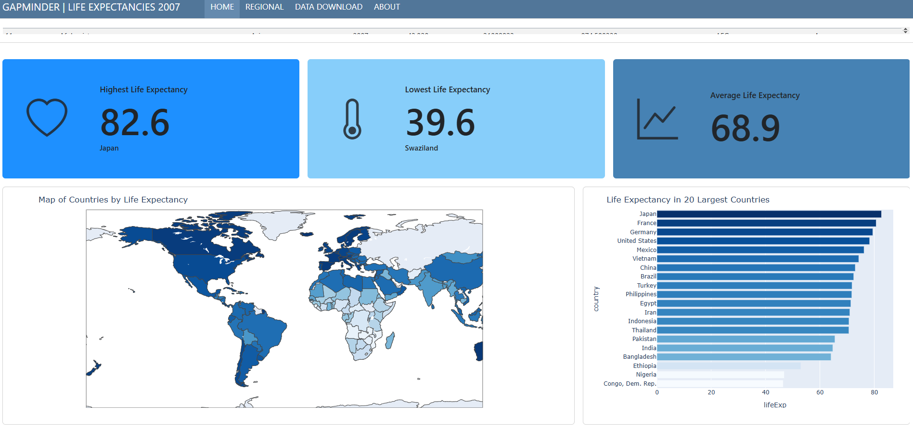
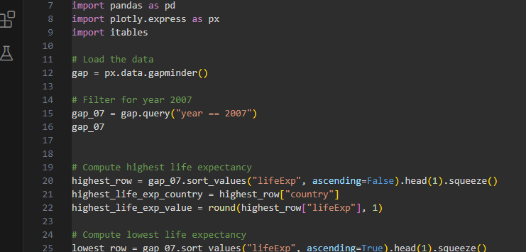
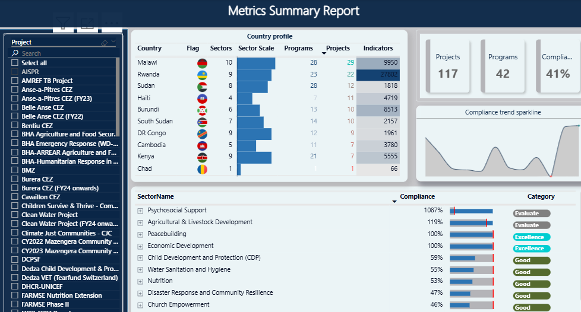
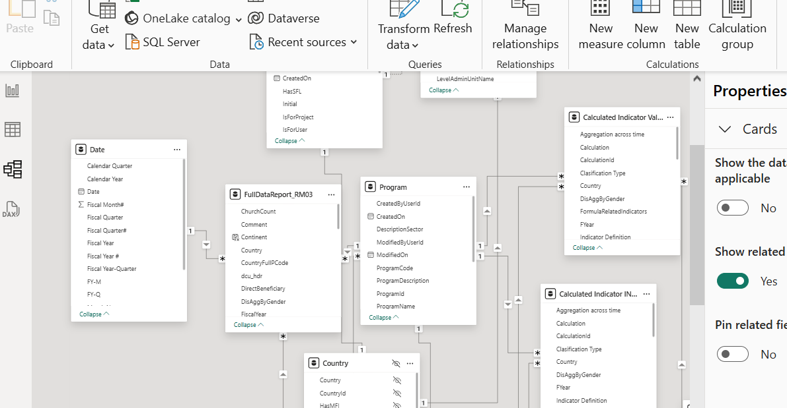
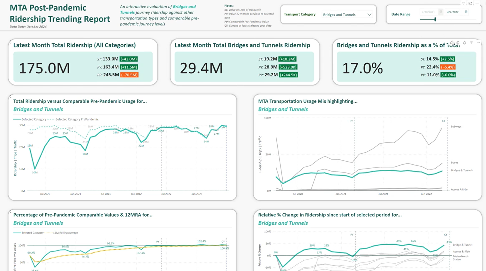
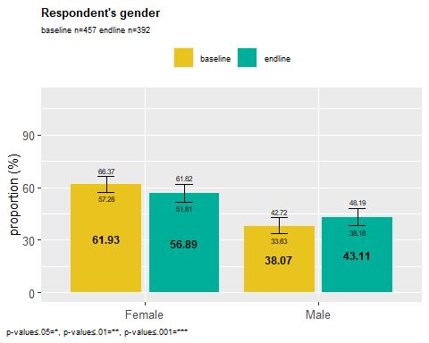
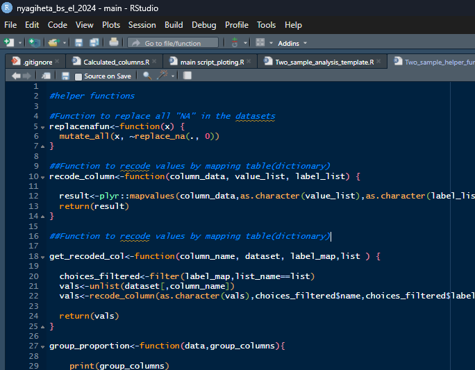

<!--Section 1: Introduce your self-->
## ABOUT ME

Hello! I'm Moses Okumu, a data analyst and visualization expert. With experience across humanitarian, health and research. I help organizations solve challenges and unlock growth through data demand and information use.

<!--Mention your top/relevant skills here - core and soft skills-->
## WHAT I DO

As Impact Systems Officer at World relief, i transform data into actionable insights using Power BI, R, Python and Excel.

  
  
  
  
  
  

<!--Section 2: List 3-4 key projects-->
## MY PORTFOLIO

*Projects I have worked on.*

**1. 2007 Life expectancies Analysis using Python, Gapminder dataset.**

This data comes from the python `plotly.express` library’s `gapminder` dataset, which is originally sourced from the Gapminder Foundation.
The Gapminder Foundation is a non-profit venture that promotes sustainable global development and achievement of the United Nations Millennium Development Goals by increasing use and understanding of statistics and other information about social, economic, and environmental development.

[view dashboard](https://mose742.github.io/my_first_repo_2025/gapminder_copy.html)

**2. Power BI Project Performance Monitoring Dashboard.**

This live Power BI dashboard pulls data from Metrix portal providing an overview of projects, programs, compliance, and sector performance across multiple countries. Key components include:

**- ✅Project Selection Panel (Left Sidebar)** – Allows users to filter by specific projects.

**- ✅Country Profile (Center Panel)** – Displays data on countries, including the number of sectors, projects, programs, and indicators.

**- ✅Key Metrics (Top Right)** – Summarizes total projects (117), programs (42), and compliance percentage (41%).

**- ✅Compliance Trend (Graph, Right Side)** – Shows compliance trends over time.

**- ✅Sector Compliance Breakdown (Bottom Right)** – Lists different sectors with their compliance percentages and category ratings (e.g., "Excellence," "Good," "Evaluate").

This dashboard is designed for monitoring and evaluation, offering insights into program distribution, compliance performance, and sectoral impact across various countries. 

**3. Post pandemic Ridership Trending Report**

The hashtag#mavencommuterchallenge gave me the opportunity to re-use and recycle a report I recently created for energy usage trends, and this time apply it to visualising recovery trends of transport usage in the MTA area in the US since the outbreak of the pandemic.
The ability to apply similar techniques, models and formats is a real time-saver, and basically allowed me to take part in spite of other commitments.
I have done a bit of a write up for anyone that would like to see the brief and approach as well as the live report. 
I have even added a few thoughts on potential additional analysis, but this report basically allows an end user to select a transportation method, and look at recovery trends versus: 

**4. Post pandemic Ridership Trending Report**

The hashtag#mavencommuterchallenge gave me the opportunity to re-use and recycle a report I recently created for energy usage trends, and this time apply it to visualising recovery trends of transport usage in the MTA area in the US since the outbreak of the pandemic.
The ability to apply similar techniques, models and formats is a real time-saver, and basically allowed me to take part in spite of other commitments.

## CONTACT DETAILS

<table>
  <tbody>
    <tr>
      <td>📧</td>
      <td><a href="mailto:anietieetuk@gmail.com">moseso664@gmail.com</a></td>
    </tr>
    <tr>
      <td>📞</td>
      <td>(254) 719-514-326</td>
    </tr>
    <tr>
      <td>📍</td>
      <td>Nairobi, Kenya</td>
    </tr>
    <tr>
      <td>⬇️</td>
      <td><a href="https://github.com/Mose742/portfolio/blob/main/documents/updated_cv.pdf">Download my CV</a></td>
    </tr>
   <tr>
    <td></td>
    <td><a href="https://www.linkedin.com/in/mosesokumu/">My LinkedIn</a></td>
</tr>

    <tr>
      <td>📺</td>
      <td><a href="https://www.youtube.com/watch?v=q__u5DOWdS8">Watch my tutorial on YouTube</a></td>
    </tr>
  </tbody>
</table>

   

