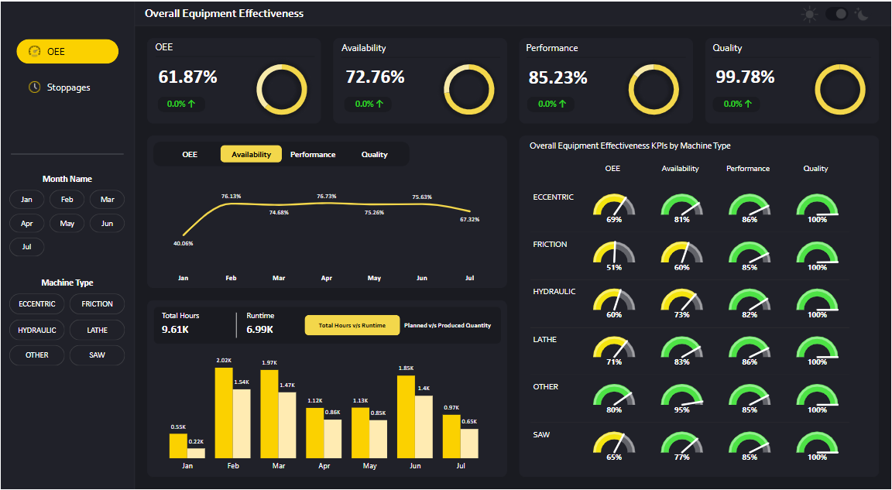
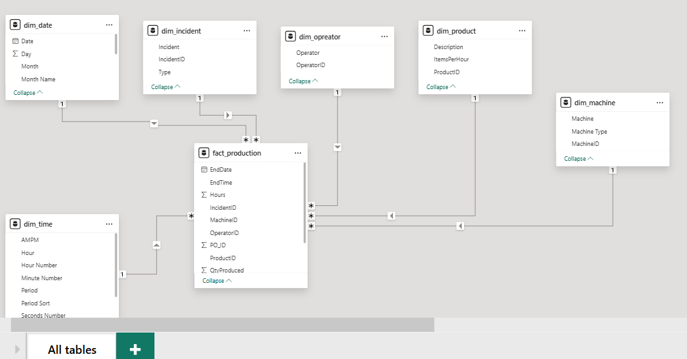
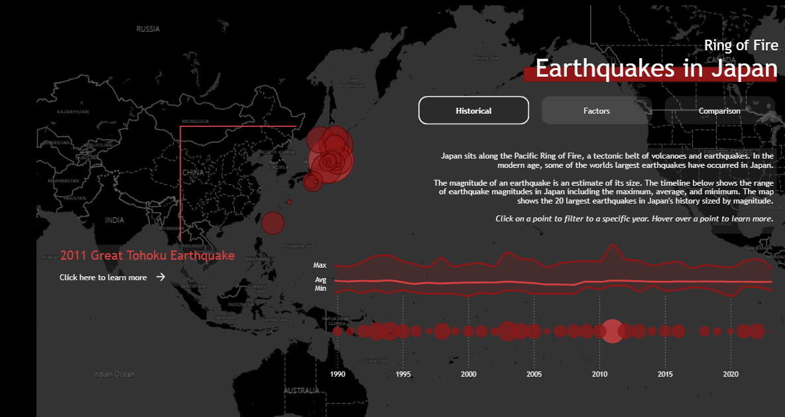
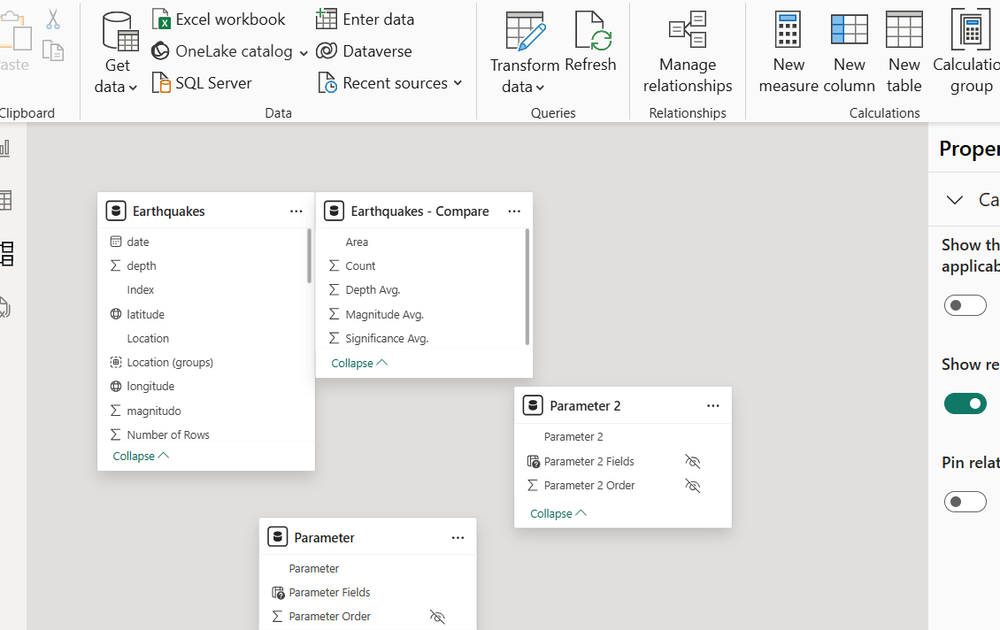

<!--Section 1: Introduce your self-->
## ABOUT ME

Hello! I'm Moses Okumu, a data analyst and visualization expert. With experience across humanitarian, health and research. I help organizations solve challenges and unlock growth through data demand and information use.

<!--Mention your top/relevant skills here - core and soft skills-->
## WHAT I DO

As Impact Systems Officer at World relief, i transform data into actionable insights using Power BI, R, Python and Excel.

  
  
  
  
  
  
  
  

**View Certifications**

[Microsoft Certified: Power BI Data Analyst Associate- PL 300](https://github.com/Mose742/portfolio/blob/main/documents/Certifications%20-%20MosesOkumu-7399%20_%20Microsoft%20Learn.pdf) | 
[Microsoft Certified: Azure Fundermentals- AZ 900](https://github.com/Mose742/portfolio/blob/main/documents/azure_cert.pdf) | 
[PM4NGOs: Mearl DPro](https://github.com/Mose742/portfolio/blob/main/documents/mear_dpro.pdf) | 
[Intro to Python](https://github.com/Mose742/portfolio/blob/main/documents/python.pdf) | 
[Intro to qGIS](https://github.com/Mose742/portfolio/blob/main/documents/gis.pdf) 
<!--Section 2: List 3-4 key projects-->
## DATA ANALYSIS & VISUALIZATION PROJECTS

**1. Power BI Overall Equipment Effectiveness Dashboard**

Overall Equipment Effectiveness Dashboard provides a visual representation of manufacturing efficiency and performance. This OEE Dashboard visually presents key performance indicators (KPIs) related to machine efficiency in a manufacturing process. The dashboard is well-structured and provides insights into availability, performance, and quality metrics.

**Features**

 - Quality is at 99.78%, meaning minimal defects.
 - Performance is high (85.23%), indicating machines are operating efficiently.
 - Availability is relatively lower (72.76%), suggesting downtime issues.
 - Friction machines have the lowest OEE (51%), which may need attention.
 - "Other" machines have the highest OEE (80%), showing the best performance
 
Each of these metrics is displayed using a gauge chart, providing a quick visual representation of efficiency.
Trend Analysis (Middle Section). Line Chart: Shows the monthly trend of availability from January to July. Availability fluctuates, peaking in March and May but dropping in July.

Bar Chart: Compares total hours vs. runtime across months.
February and June show the highest working hours.
Lower runtime in some months may indicate downtime issues
Machine-Specific OEE Analysis (Right Section)
Gauge Charts for Each Machine Type (Lathe, Other, Hydraulic, Friction, Eccentric, Saw)
OEE, Availability, Performance, and Quality are shown for each machine.
"Other" machines perform best (OEE: 80%), while Friction machines perform worst (OEE: 51%).
Quality is consistently at 100% across all machine types, meaning defects are minimal.

Filters (Left Sidebar)
Month Selector: Allows users to filter data by selecting specific months (Jan to Jul).
Machine Type Selector: Enables users to analyze performance for different types of machines.

Tips and formatting: *Page navigation on single page, Key performance indicators, Filters, Slices, Measures, Visuals, Svgs, Power BI key visuals eg cards, donut chart, Bookmarks and Modeling*

[view dashboard](https://app.powerbi.com/view?r=eyJrIjoiYzdhNWFhZDctNDdiMy00OTRmLWJmMWQtY2Y1M2JhNzQ3MGJjIiwidCI6ImU4ZjAzNDIxLWFjZGItNDE5MC04N2M0LTJlNDVkYWNkMmQxYSIsImMiOjF9)

[pbx file and data on github](https://github.com/Mose742/power_bi_files)

**2. 2007 Life expectancies Dashboard in Quarto using Python**

This is my final Python bootcamp project on “Data analysis using Python”. The data comes from the python `plotly.express` library’s `gapminder` dataset, which is originally sourced from the Gapminder Foundation.

The Gapminder Foundation is a non-profit venture that promotes sustainable global development and achievement of the United Nations Millennium Development Goals by increasing use and understanding of statistics and other information about social, economic, and environmental development.

I used visual studio code installed with quarto. Inserted the header for title and format and file format. For surety, render in to preview the dashboard outlook. To insert pages, use the hash tag #, e.g. #1 for page 1 and # 2 for page 2 respectively. 
You can insert plots by first importing pandas as pd, plotly.express as pd and itables library, create charts and compute the summery statistics, then add them to your pages. and embed them on the preferred pages created above. 

To indicate the rows, use ## to customize your dashboard, command the height by {xx}. To add column, use the hash ###, customise {}.
To add tab, use hash i.e. ####. You can add value boxes at the top row using markdown syntax::: { value box}:::  and specify value box colour. Source the quarto dashboard theme com and add your favorite theme. Then publish to GitHub. 

[view dashboard](https://mose742.github.io/my_first_repo_2025/gapminder_copy.html)

[view on github](https://github.com/Mose742/my_first_repo_2025/blob/main/gapminder_copy.qmd)

**3. Baseline vs Endline Survey Analysis using R**

The data belongs to organization XX, the organization did baseline and endline survey on their project in country YY to assess the market. Data was collected using ODK and stored in Kobo.    I conducted a comparative analysis between baseline and endline survey data using R. 

The analysis focused on evaluating market trends, price variations, and other key economic and social indicators. Statistical significance was assessed using p-values to determine whether observed differences between the two time points were statistically meaningful. The findings provided insights into market dynamics, informing programmatic decisions and intervention strategies.

The following files were developed using R; 
	Two sample analysis.R- For data preparation
	Two sample chart visuals library
	Two sample helper function
	Validation script
	Calculated columns
That baseline and end line data pulled from my PC and transformed to match the xlsx questionnaire.

**4. Power BI Earthquack Dashboard.**

Inspired by the recent anniversary of the 2011 Great Tohoku Earthquake, I created a visualization on earthquakes in Japan. Situated along the 'Ring of Fire,' Japan experiences significant seismic activity, providing a wealth of earthquake data.
I chose a dark theme with red accents to reflect the 'Land of the Rising Sun.' Additionally, I utilized only base Power BI visuals to highlight the capabilities of core Power BI.
*Revamped from Kamata*

[view dashboard](https://app.powerbi.com/view?r=eyJrIjoiMzUyMjVhOTItMjFlOC00NWQzLTk2NTItY2RlZWM4NGRmNjlkIiwidCI6ImU4ZjAzNDIxLWFjZGItNDE5MC04N2M0LTJlNDVkYWNkMmQxYSIsImMiOjF9)

## CONTACT DETAILS

<table>
  <tbody>
    <tr>
      <td>📧</td>
      <td><a href="mailto:anietieetuk@gmail.com">moseso664@gmail.com</a></td>
    </tr>
    <tr>
      <td>📞</td>
      <td>(254) 719-514-326</td>
    </tr>
    <tr>
      <td>📍</td>
      <td>Nairobi, Kenya</td>
    </tr>
    <tr>
    <td></td>
    <td><a href="https://www.linkedin.com/in/mosesokumu/">My LinkedIn</a></td>
   </tr>  
    <tr>
      <td>📺</td>
      <td><a href="https://www.youtube.com/watch?v=q__u5DOWdS8">Watch my tutorial on YouTube</a></td>
    </tr>
  </tbody>
</table>

   

